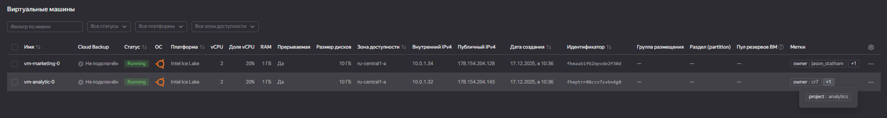
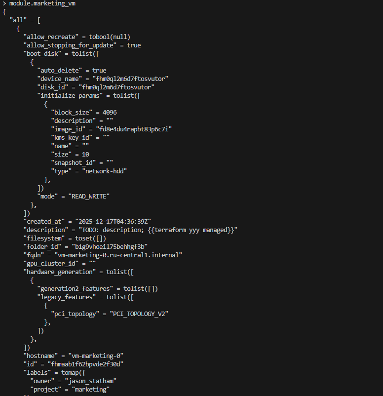
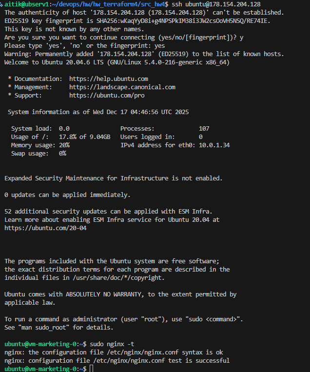

# Домашнее задание к занятию «`Продвинутые методы работы с Terraform`» - `Айткожоев Бактыбек`

### Цели задания

1. Научиться использовать модули.
2. Отработать операции state.
3. Закрепить пройденный материал.


### Чек-лист готовности к домашнему заданию

1. Зарегистрирован аккаунт в Yandex Cloud. Использован промокод на грант.
2. Установлен инструмент Yandex CLI.
3. Исходный код для выполнения задания расположен в директории [**04/src**](https://github.com/netology-code/ter-homeworks/tree/main/04/src).
4. Любые ВМ, использованные при выполнении задания, должны быть прерываемыми, для экономии средств.

------
### Внимание!! Обязательно предоставляем на проверку получившийся код в виде ссылки на ваш github-репозиторий!
Убедитесь что ваша версия **Terraform** ~>1.12.0
Пишем красивый код, хардкод значения не допустимы!
------

### Задание 1

1. Возьмите из [демонстрации к лекции готовый код](https://github.com/netology-code/ter-homeworks/tree/main/04/demonstration1) для создания с помощью двух вызовов remote-модуля -> двух ВМ, относящихся к разным проектам(marketing и analytics) используйте labels для обозначения принадлежности.  В файле cloud-init.yml необходимо использовать переменную для ssh-ключа вместо хардкода. Передайте ssh-ключ в функцию template_file в блоке vars ={} .
Воспользуйтесь [**примером**](https://grantorchard.com/dynamic-cloudinit-content-with-terraform-file-templates/). Обратите внимание, что ssh-authorized-keys принимает в себя список, а не строку.
3. Добавьте в файл cloud-init.yml установку nginx.
4. Предоставьте скриншот подключения к консоли и вывод команды ```sudo nginx -t```, скриншот консоли ВМ yandex cloud с их метками. Откройте terraform console и предоставьте скриншот содержимого модуля. Пример: > module.marketing_vm


------

------

------

В случае использования MacOS вы получите ошибку "Incompatible provider version" . В этом случае скачайте remote модуль локально и поправьте в нем версию template провайдера на более старую.
------

### Задание 2

1. Напишите локальный модуль vpc, который будет создавать 2 ресурса: **одну** сеть и **одну** подсеть в зоне, объявленной при вызове модуля, например: ```ru-central1-a```.
2. Вы должны передать в модуль переменные с названием сети, zone и v4_cidr_blocks.
3. Модуль должен возвращать в root module с помощью output информацию о yandex_vpc_subnet. Пришлите скриншот информации из terraform console о своем модуле. Пример: > module.vpc_dev  
4. Замените ресурсы yandex_vpc_network и yandex_vpc_subnet созданным модулем. Не забудьте передать необходимые параметры сети из модуля vpc в модуль с виртуальной машиной.
5. Сгенерируйте документацию к модулю с помощью terraform-docs. 

[Сгенерированная документация к модулю vpc_dev с помощью terraform-docs](./src_hw4/vpc/README.md)  
 
Пример вызова

```
module "vpc_dev" {
  source       = "./vpc"
  env_name     = "develop"
  zone = "ru-central1-a"
  cidr = "10.0.1.0/24"
}
```

### Задание 3
1. Выведите список ресурсов в стейте.
2. Полностью удалите из стейта модуль vpc.
3. Полностью удалите из стейта модуль vm.
4. Импортируйте всё обратно. Проверьте terraform plan. Значимых(!!) изменений быть не должно.
Приложите список выполненных команд и скриншоты процессы.

```
terraform state list

terraform state rm module.marketing_vm
terraform state rm module.analytics_vm
terraform state rm module.vpc_dev

terraform import module.vpc_dev.yandex_vpc_network.network enp84kc1r4g3kt67tlbj
terraform import module.vpc_dev.yandex_vpc_subnet.subnet e9bg8ohqd1rkgvv849vv

terraform import 'module.analytics_vm.yandex_compute_instance.vm[0]' fhm3ceanmjdl7e1u2th7
terraform import 'module.marketing_vm.yandex_compute_instance.vm[0]' fhmv3d79dupo0rmee1qi

terraform state list

data.template_file.cloudinit
data.yandex_compute_image.ubuntu
module.analytics_vm.data.yandex_compute_image.my_image
module.analytics_vm.yandex_compute_instance.vm[0]
module.marketing_vm.data.yandex_compute_image.my_image
module.marketing_vm.yandex_compute_instance.vm[0]
module.vpc_dev.yandex_vpc_network.network
module.vpc_dev.yandex_vpc_subnet.subnet

aitik@ubserv1:~/devops/hw/hw_terraform4/src_hw4$ terraform state rm module.marketing_vm
terraform state rm module.analytics_vm
terraform state rm module.vpc_dev
Removed module.marketing_vm.data.yandex_compute_image.my_image
Removed module.marketing_vm.yandex_compute_instance.vm[0]
Successfully removed 2 resource instance(s).
Removed module.analytics_vm.data.yandex_compute_image.my_image
Removed module.analytics_vm.yandex_compute_instance.vm[0]
Successfully removed 2 resource instance(s).
Removed module.vpc_dev.yandex_vpc_network.network
Removed module.vpc_dev.yandex_vpc_subnet.subnet
Successfully removed 2 resource instance(s).


aitik@ubserv1:~/devops/hw/hw_terraform4/src_hw4$ terraform import module.vpc_dev.yandex_vpc_network.network enp84kc1r4g3kt67tlbj
data.template_file.cloudinit: Reading...
data.template_file.cloudinit: Read complete after 0s [id=1014bf0265a4f3bdec54707926378e4d50654a334b477ced3f3c5cfb5c05ac1b]
module.vpc_dev.yandex_vpc_network.network: Importing from ID "enp84kc1r4g3kt67tlbj"...
module.vpc_dev.yandex_vpc_network.network: Import prepared!
  Prepared yandex_vpc_network for import
module.marketing_vm.data.yandex_compute_image.my_image: Reading...
module.vpc_dev.yandex_vpc_network.network: Refreshing state... [id=enp84kc1r4g3kt67tlbj]
module.analytics_vm.data.yandex_compute_image.my_image: Reading...
data.yandex_compute_image.ubuntu: Reading...
data.yandex_compute_image.ubuntu: Read complete after 1s [id=fd8e4du4rapbt83p6c7i]
module.analytics_vm.data.yandex_compute_image.my_image: Read complete after 1s [id=fd8e4du4rapbt83p6c7i]
module.marketing_vm.data.yandex_compute_image.my_image: Read complete after 1s [id=fd8e4du4rapbt83p6c7i]

Import successful!

The resources that were imported are shown above. These resources are now in
your Terraform state and will henceforth be managed by Terraform.

aitik@ubserv1:~/devops/hw/hw_terraform4/src_hw4$ terraform import module.vpc_dev.yandex_vpc_subnet.subnet e9bg8ohqd1rkgvv849vv
data.template_file.cloudinit: Reading...
data.template_file.cloudinit: Read complete after 0s [id=1014bf0265a4f3bdec54707926378e4d50654a334b477ced3f3c5cfb5c05ac1b]
module.marketing_vm.data.yandex_compute_image.my_image: Reading...
module.analytics_vm.data.yandex_compute_image.my_image: Reading...
data.yandex_compute_image.ubuntu: Reading...
module.vpc_dev.yandex_vpc_subnet.subnet: Importing from ID "e9bg8ohqd1rkgvv849vv"...
module.vpc_dev.yandex_vpc_subnet.subnet: Import prepared!
  Prepared yandex_vpc_subnet for import
module.vpc_dev.yandex_vpc_subnet.subnet: Refreshing state... [id=e9bg8ohqd1rkgvv849vv]
data.yandex_compute_image.ubuntu: Read complete after 0s [id=fd8e4du4rapbt83p6c7i]
module.marketing_vm.data.yandex_compute_image.my_image: Read complete after 0s [id=fd8e4du4rapbt83p6c7i]
module.analytics_vm.data.yandex_compute_image.my_image: Read complete after 0s [id=fd8e4du4rapbt83p6c7i]

Import successful!

The resources that were imported are shown above. These resources are now in
your Terraform state and will henceforth be managed by Terraform.

aitik@ubserv1:~/devops/hw/hw_terraform4/src_hw4$ terraform import 'module.analytics_vm.yandex_compute_instance.vm[0]' fhm3ceanmjdl7e1u2th7
data.template_file.cloudinit: Reading...
data.template_file.cloudinit: Read complete after 0s [id=1014bf0265a4f3bdec54707926378e4d50654a334b477ced3f3c5cfb5c05ac1b]
module.analytics_vm.data.yandex_compute_image.my_image: Reading...
module.marketing_vm.data.yandex_compute_image.my_image: Reading...
data.yandex_compute_image.ubuntu: Reading...
module.marketing_vm.data.yandex_compute_image.my_image: Read complete after 1s [id=fd8e4du4rapbt83p6c7i]
data.yandex_compute_image.ubuntu: Read complete after 1s [id=fd8e4du4rapbt83p6c7i]
module.analytics_vm.data.yandex_compute_image.my_image: Read complete after 1s [id=fd8e4du4rapbt83p6c7i]
module.analytics_vm.yandex_compute_instance.vm[0]: Importing from ID "fhm3ceanmjdl7e1u2th7"...
module.analytics_vm.yandex_compute_instance.vm[0]: Import prepared!
  Prepared yandex_compute_instance for import
module.analytics_vm.yandex_compute_instance.vm[0]: Refreshing state... [id=fhm3ceanmjdl7e1u2th7]

Import successful!

The resources that were imported are shown above. These resources are now in
your Terraform state and will henceforth be managed by Terraform.

aitik@ubserv1:~/devops/hw/hw_terraform4/src_hw4$ terraform import 'module.marketing_vm.yandex_compute_instance.vm[0]' fhmv3d79dupo0rmee1qi
data.template_file.cloudinit: Reading...
data.template_file.cloudinit: Read complete after 0s [id=1014bf0265a4f3bdec54707926378e4d50654a334b477ced3f3c5cfb5c05ac1b]
module.analytics_vm.data.yandex_compute_image.my_image: Reading...
module.marketing_vm.data.yandex_compute_image.my_image: Reading...
data.yandex_compute_image.ubuntu: Reading...
module.marketing_vm.data.yandex_compute_image.my_image: Read complete after 0s [id=fd8e4du4rapbt83p6c7i]
module.marketing_vm.yandex_compute_instance.vm[0]: Importing from ID "fhmv3d79dupo0rmee1qi"...
module.marketing_vm.yandex_compute_instance.vm[0]: Import prepared!
  Prepared yandex_compute_instance for import
module.marketing_vm.yandex_compute_instance.vm[0]: Refreshing state... [id=fhmv3d79dupo0rmee1qi]
data.yandex_compute_image.ubuntu: Read complete after 1s [id=fd8e4du4rapbt83p6c7i]
module.analytics_vm.data.yandex_compute_image.my_image: Read complete after 1s [id=fd8e4du4rapbt83p6c7i]

Import successful!

The resources that were imported are shown above. These resources are now in
your Terraform state and will henceforth be managed by Terraform.

aitik@ubserv1:~/devops/hw/hw_terraform4/src_hw4$ terraform plan
data.template_file.cloudinit: Reading...
data.template_file.cloudinit: Read complete after 0s [id=1014bf0265a4f3bdec54707926378e4d50654a334b477ced3f3c5cfb5c05ac1b]
data.yandex_compute_image.ubuntu: Reading...
module.analytics_vm.data.yandex_compute_image.my_image: Reading...
module.marketing_vm.data.yandex_compute_image.my_image: Reading...
module.vpc_dev.yandex_vpc_network.network: Refreshing state... [id=enp84kc1r4g3kt67tlbj]
module.marketing_vm.data.yandex_compute_image.my_image: Read complete after 1s [id=fd8e4du4rapbt83p6c7i]
module.analytics_vm.data.yandex_compute_image.my_image: Read complete after 1s [id=fd8e4du4rapbt83p6c7i]
data.yandex_compute_image.ubuntu: Read complete after 1s [id=fd8e4du4rapbt83p6c7i]
module.vpc_dev.yandex_vpc_subnet.subnet: Refreshing state... [id=e9bg8ohqd1rkgvv849vv]
module.marketing_vm.yandex_compute_instance.vm[0]: Refreshing state... [id=fhmv3d79dupo0rmee1qi]
module.analytics_vm.yandex_compute_instance.vm[0]: Refreshing state... [id=fhm3ceanmjdl7e1u2th7]

Terraform used the selected providers to generate the following execution plan. Resource actions are indicated with the following symbols:
  ~ update in-place

Terraform will perform the following actions:

  # module.analytics_vm.yandex_compute_instance.vm[0] will be updated in-place
  ~ resource "yandex_compute_instance" "vm" {
      + allow_stopping_for_update = true
        id                        = "fhm3ceanmjdl7e1u2th7"
        name                      = "vm-analytic-0"
        # (15 unchanged attributes hidden)

        # (6 unchanged blocks hidden)
    }

  # module.marketing_vm.yandex_compute_instance.vm[0] will be updated in-place
  ~ resource "yandex_compute_instance" "vm" {
      + allow_stopping_for_update = true
        id                        = "fhmv3d79dupo0rmee1qi"
        name                      = "vm-marketing-0"
        # (15 unchanged attributes hidden)

        # (6 unchanged blocks hidden)
    }

Plan: 0 to add, 2 to change, 0 to destroy.

───────────────────────────────────────────────────────────────────────────────────────────────────────────

Note: You didn't use the -out option to save this plan, so Terraform can't guarantee to take exactly these actions if you run "terraform apply" now.
aitik@ubserv1:~/devops/hw/hw_terraform4/src_hw4$ 

ssh ubuntu@178.154.231.3
Welcome to Ubuntu 20.04.6 LTS (GNU/Linux 5.4.0-216-generic x86_64)

 * Documentation:  https://help.ubuntu.com
 * Management:     https://landscape.canonical.com
 * Support:        https://ubuntu.com/pro

 System information as of Wed Dec 17 08:35:19 UTC 2025

  System load:  0.0               Processes:             106
  Usage of /:   17.8% of 9.04GB   Users logged in:       0
  Memory usage: 20%               IPv4 address for eth0: 10.0.1.9
  Swap usage:   0%

ubuntu@vm-analytic-0:~$ sudo nginx -t
nginx: the configuration file /etc/nginx/nginx.conf syntax is ok
nginx: configuration file /etc/nginx/nginx.conf test is successful
ubuntu@vm-analytic-0:~$ 

```bash curl -Lo ./terraform-docs https://www.google.com/search?q=https://github.com/terraform-docs/terraform-docs/releases/download/v0.16.0/terraform-docs-v0.16.0-%24(uname)-amd64 chmod +x ./terraform-docs sudo mv ./terraform-docs /usr/local/bin/

```
---

## Дополнительные задания (со звёздочкой*)

**Настоятельно рекомендуем выполнять все задания со звёздочкой.**   Они помогут глубже разобраться в материале.   
Задания со звёздочкой дополнительные, не обязательные к выполнению и никак не повлияют на получение вами зачёта по этому домашнему заданию. 


### Задание 4*

1. Измените модуль vpc так, чтобы он мог создать подсети во всех зонах доступности, переданных в переменной типа list(object) при вызове модуля.  
  
Пример вызова
```
module "vpc_prod" {
  source       = "./vpc"
  env_name     = "production"
  subnets = [
    { zone = "ru-central1-a", cidr = "10.0.1.0/24" },
    { zone = "ru-central1-b", cidr = "10.0.2.0/24" },
    { zone = "ru-central1-c", cidr = "10.0.3.0/24" },
  ]
}

module "vpc_dev" {
  source       = "./vpc"
  env_name     = "develop"
  subnets = [
    { zone = "ru-central1-a", cidr = "10.0.1.0/24" },
  ]
}
```

```
Добавил новый модуль vpc_prod

# Создание сети
resource "yandex_vpc_network" "prod_network" {
  name = "${var.env_name}-network"
}

# Создание подсетей через цикл
resource "yandex_vpc_subnet" "subnet" {
  # Преобразуем список в карту, чтобы использовать for_each
  for_each = { for s in var.subnets : s.zone => s }
  name           = "${var.env_name}-subnet-${each.value.zone}"
  zone           = each.value.zone
  network_id     = yandex_vpc_network.prod_network.id
  v4_cidr_blocks = [each.value.cidr]
}

Вызов модуля

module "vpc_prod" {
  source   = "./vpc_prod"
  env_name = "production"
  subnets  = [
    { zone = var.default_zone, cidr = var.default_cidr[0] },
    { zone = var.zone_b,       cidr = var.default_cidr[1] },
    { zone = var.zone_c,       cidr = var.default_cidr[2] },
  ]
}

terraform plan 

# module.vpc_dev.yandex_vpc_network.network will be created
  + resource "yandex_vpc_network" "network" {
      + created_at                = (known after apply)
      + default_security_group_id = (known after apply)
      + folder_id                 = (known after apply)
      + id                        = (known after apply)
      + labels                    = (known after apply)
      + name                      = "develop"
      + subnet_ids                = (known after apply)
    }

  # module.vpc_dev.yandex_vpc_subnet.subnet will be created
  + resource "yandex_vpc_subnet" "subnet" {
      + created_at     = (known after apply)
      + folder_id      = (known after apply)
      + id             = (known after apply)
      + labels         = (known after apply)
      + name           = "develop-subnet"
      + network_id     = (known after apply)
      + v4_cidr_blocks = [
          + "10.0.1.0/24",
        ]
      + v6_cidr_blocks = (known after apply)
      + zone           = "ru-central1-a"
    }

  # module.vpc_prod.yandex_vpc_network.prod_network will be created
  + resource "yandex_vpc_network" "prod_network" {
      + created_at                = (known after apply)
      + default_security_group_id = (known after apply)
      + folder_id                 = (known after apply)
      + id                        = (known after apply)
      + labels                    = (known after apply)
      + name                      = "production-network"
      + subnet_ids                = (known after apply)
    }

  # module.vpc_prod.yandex_vpc_subnet.subnet["ru-central1-a"] will be created
  + resource "yandex_vpc_subnet" "subnet" {
      + created_at     = (known after apply)
      + folder_id      = (known after apply)
      + id             = (known after apply)
      + labels         = (known after apply)
      + name           = "production-subnet-ru-central1-a"
      + network_id     = (known after apply)
      + v4_cidr_blocks = [
          + "10.0.1.0/24",
        ]
      + v6_cidr_blocks = (known after apply)
      + zone           = "ru-central1-a"
    }

  # module.vpc_prod.yandex_vpc_subnet.subnet["ru-central1-b"] will be created
  + resource "yandex_vpc_subnet" "subnet" {
      + created_at     = (known after apply)
      + folder_id      = (known after apply)
      + id             = (known after apply)
      + labels         = (known after apply)
      + name           = "production-subnet-ru-central1-b"
      + network_id     = (known after apply)
      + v4_cidr_blocks = [
          + "10.0.2.0/24",
        ]
      + v6_cidr_blocks = (known after apply)
      + zone           = "ru-central1-b"
    }

  # module.vpc_prod.yandex_vpc_subnet.subnet["ru-central1-c"] will be created
  + resource "yandex_vpc_subnet" "subnet" {
      + created_at     = (known after apply)
      + folder_id      = (known after apply)
      + id             = (known after apply)
      + labels         = (known after apply)
      + name           = "production-subnet-ru-central1-c"
      + network_id     = (known after apply)
      + v4_cidr_blocks = [
          + "10.0.3.0/24",
        ]
      + v6_cidr_blocks = (known after apply)
      + zone           = "ru-central1-c"
    }

Plan: 8 to add, 0 to change, 0 to destroy.
```
Предоставьте код, план выполнения, результат из консоли YC.

### Задание 5*

1. Напишите модуль для создания кластера managed БД Mysql в Yandex Cloud с одним или несколькими(2 по умолчанию) хостами в зависимости от переменной HA=true или HA=false. Используйте ресурс yandex_mdb_mysql_cluster: передайте имя кластера и id сети.
2. Напишите модуль для создания базы данных и пользователя в уже существующем кластере managed БД Mysql. Используйте ресурсы yandex_mdb_mysql_database и yandex_mdb_mysql_user: передайте имя базы данных, имя пользователя и id кластера при вызове модуля.
3. Используя оба модуля, создайте кластер example из одного хоста, а затем добавьте в него БД test и пользователя app. Затем измените переменную и превратите сингл хост в кластер из 2-х серверов.
4. Предоставьте план выполнения и по возможности результат. Сразу же удаляйте созданные ресурсы, так как кластер может стоить очень дорого. Используйте минимальную конфигурацию.

### Задание 6*
1. Используя готовый yandex cloud terraform module и пример его вызова(examples/simple-bucket): https://github.com/terraform-yc-modules/terraform-yc-s3 .
Создайте и не удаляйте для себя s3 бакет размером 1 ГБ(это бесплатно), он пригодится вам в ДЗ к 5 лекции.

### Задание 7*

1. Разверните у себя локально vault, используя docker-compose.yml в проекте.
2. Для входа в web-интерфейс и авторизации terraform в vault используйте токен "education".
3. Создайте новый секрет по пути http://127.0.0.1:8200/ui/vault/secrets/secret/create
Path: example  
secret data key: test 
secret data value: congrats!  
4. Считайте этот секрет с помощью terraform и выведите его в output по примеру:
```
provider "vault" {
 address = "http://<IP_ADDRESS>:<PORT_NUMBER>"
 skip_tls_verify = true
 token = "education"
}
data "vault_generic_secret" "vault_example"{
 path = "secret/example"
}

output "vault_example" {
 value = "${nonsensitive(data.vault_generic_secret.vault_example.data)}"
} 

Можно обратиться не к словарю, а конкретному ключу:
terraform console: >nonsensitive(data.vault_generic_secret.vault_example.data.<имя ключа в секрете>)
```
5. Попробуйте самостоятельно разобраться в документации и записать новый секрет в vault с помощью terraform. 

### Задание 8*
Попробуйте самостоятельно разобраться в документаци и с помощью terraform remote state разделить root модуль на два отдельных root-модуля: создание VPC , создание ВМ . 

### Правила приёма работы

В своём git-репозитории создайте новую ветку terraform-04, закоммитьте в эту ветку свой финальный код проекта. Ответы на задания и необходимые скриншоты оформите в md-файле в ветке terraform-04.

В качестве результата прикрепите ссылку на ветку terraform-04 в вашем репозитории.

**Важно.** Удалите все созданные ресурсы.

### Критерии оценки

Зачёт ставится, если:

* выполнены все задания,
* ответы даны в развёрнутой форме,
* приложены соответствующие скриншоты и файлы проекта,
* в выполненных заданиях нет противоречий и нарушения логики.

На доработку работу отправят, если:

* задание выполнено частично или не выполнено вообще,
* в логике выполнения заданий есть противоречия и существенные недостатки. 


